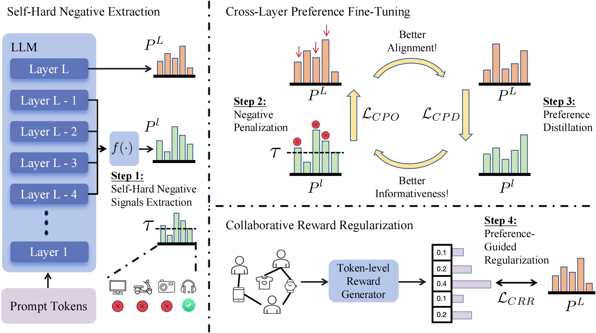

# ILRec
The official implementation of ILRec.
The implementation of ILRec is based on PyTorch and RecBole.

## Overview
* We present ILRec, a novel LLM-based recommendation frame-work that extracts fine-grained self-hard negative signals from intermediate layers for preference optimization.
* We propose the cross-layer preference fine-tuning to penalize negative tokens based on the self-hard signals during LLM fine-tuning. Moreover, we introduce collaborative reward regularization to prevent over-penalty and integrate collaborative information.



## Quick Start
1. Pre-processing
```bash
python data_processing.py
```

2. Train the model with ILRec framework
LC-Rec:
```bash
bash ./train/ilrec-lcrec.sh
```
BIGRec:
```bash
bash ./train/ilrec-bigrec.sh
```

